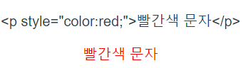
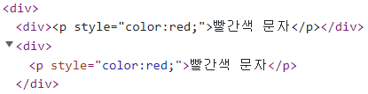
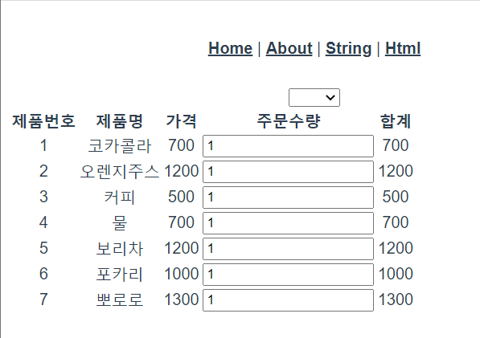

# Vue3 시작하기

## 1. vue create “name”

### 1. package.json 구조

- “private”
  - npm에 업로드할 때, 비공개 여부(true = 비공개)
- “script”
  - 터미널에 입력할 수 있는 명령어
  - “key”: “command”
- “dependencies”
  - 배포했을 때 운영환경에서 필요한 모듈
- “devDependencies”
  - 개발할 때 사용한 모듈
- “browserslist”
  - 사용할 브라우저 조건 설정

### 2. package-lock.json

- npm으로 설치한 모듈이 들어있음

### 3. main.js

- index.html을 구동하는 파일

```jsx
# vue 모듈에서 createApp을 가져옴
import { createApp } from 'vue'
# App.vue를 App으로 가져옴
import App from './App.vue'

# ./public/index.html내부에 id="app"인 곳에 mount를 시킴
createApp(App).mount('#app')
```

### 4. index.html

- 서비스하는 파일

## 2. vue create - settings

### 1. Babel

- 최신 문법으로 짠 코드를 구 브라우저에서도 작동할 수 있게끔 구 자바스크립트 코드로 컴파일 해주는 모듈

### 2. Progressive Web App(PWA) Support

- 모바일처럼 웹을 구현할 수 있음

### 3. Router

- 메뉴를 구성하고 클릭했을 때, 화면 이동을 할 수 있게 해주는 모듈

### 4. Vuex

- 모든 Vue component가 접근할 수 있는 저장소를 만들어주는 모듈

### 5. Linter / Formatter

- 자바스크립트 문법 체크
- 여러명이서 코딩 문법, 코딩 컨벤션을 통일하게끔 만들 수 있는 모듈

## 3. Router

```jsx
<template>
  <nav>
    /* to="" -> path, router/index.js 코드에서 ""와 동일한 path를 가진
    component를 불러온다. */
    <router-link to="/">Home</router-link> |<router-link to="/about">About</router-link>
  </nav>
  /* 동적으로 html코드를 수정한다. */
  <router-view />
</template>
```

```jsx
/* @ = src폴더*/
'@/components/HelloWorld.vue'
```

- Router에서 component를 넣는 방법

```jsx
/* 무조건 들어가는 화면(메인 화면)일 때 사용 */
import HomeView from '../views/HomeView.vue'
component: HomeView
---
/* 사이즈가 크거나, 바로	들어갈 확률이 매우 높은 화면일 때 사용 */
component: () => import(/* webpackChunkName: "about", webpackPrefetch:true */
												 '../views/AboutView.vue')

/* 사이즈가 작거나, 사용 빈도가 많지 않은 화면일 때 사용 */
component: () => import(/* webpackChunkName: "about" */ '../views/AboutView.vue')
```

## 4. 데이터 바인딩

- views = 화면 전체를 차지하는 component를 저장
  - 파일명 끝에 View를 붙이는 관행이 있음
- components = 재사용이 가능한 component를 저장

```jsx
/* html태그는 template에 넣으면 됨 */
<template>

</template>
/* 자바스크립트 태그는 script에 넣으면 됨 */
<script>
export default {
    data() {
        return {
            userName: "John Doe"
        }
    }
}
</script>
/* scoped를 쓰면 해당 component에서만 적용
	 전체 component에 적용하고 싶으면 scoped를 제거 */
<style scoped>
.text-red {
    color: red;
}
</style>
```

- Router(index.js)에서 webpackChunkName의 이름을 같게 해주면 grouping이 가능

```jsx
<template>
  <div>
    <div>{{ htmlString }}</div>
		/* Directive를 사용하면 ""안의 key값을 찾아 html태그로 추가해준다. */
    <div v-html="htmlString"></div>
  </div>
</template>
<script>
export default {
  components: {},
  data() {
    return {
      htmlString: '<p style="color:red;">빨간색 문자</p>'
    }
  },
  setup() {},
  created() {},
  mounted() {},
  unmounted() {},
  methods: {}
}
</script>
```





```jsx
<template>
  <div>
		/* v-model = 양방향 데이터 바인딩 ->
			 함수에서도 바꿀 수 있고, 사용자가 바꿀 수 있음 */
    <input type="text" v-model="userId" />
  </div>
</template>
<script>
export default {
  components: {},
  data() {
    return {
      userId: 'blue4683'
    }
  },
  setup() {},
  created() {},
  mounted() {},
  unmounted() {},
  methods: {}
}
</script>
```

- checkbox = 여러개를 선택할 수 있으므로, 값을 배열로 선언해야함
- radio = 하나만 선택할 수 있으므로, 값을 문자열로 선언해야함

```jsx
<template>
  <div>
		/* readonly로 값을 변경하는것을 원치않는 경우 단방향으로 선언
			 v-bind는 생략가능(:) */
		<input type="text" name="" id="" v-bind:value="userId" readonly />
    <input type="text" name="" id="" :value="userId" readonly />
  </div>
</template>
<script>
export default {
  components: {},
  data() {
    return {
      userId: 'blue4683'
    }
  },
  setup() {},
  created() {},
  mounted() {},
  unmounted() {},
  methods: {}
}
</script>
```

- v-for = for문처럼 특정 key를 가지고 반복문을 돌릴 수 있음

```jsx
<template>
  <div>
    <div>
      <select name="" id="">
        <option value=""></option>
        <option value="city.code" :key="city.code" v-for="city in cities">
          {{ city.title }}
        </option>
      </select>
    </div>
    <div>
      <table>
        <thead>
          <tr>
            <th>제품번호</th>
            <th>제품명</th>
            <th>가격</th>
            <th>주문수량</th>
            <th>합계</th>
          </tr>
        </thead>
        <tbody>
          <tr :key="drink.drinkId" v-for="drink in drinkList">
            <td>{{ drink.drinkId }}</td>
            <td>{{ drink.drinkName }}</td>
            <td>{{ drink.price }}</td>
            <td><input type="number" name="" id="" v-model="drink.qty" /></td>
            <td>{{ drink.price * drink.qty }}</td>
          </tr>
        </tbody>
      </table>
    </div>
  </div>
</template>
<script>
export default {
  components: {},
  data() {
    return {
      cities: [
        { title: '서울', code: '02' },
        { title: '부산', code: '051' },
        { title: '제주', code: '064' }
      ],
      drinkList: [
        {
          drinkId: '1',
          drinkName: '코카콜라',
          price: 700,
          qty: 1
        },
        {
          drinkId: '2',
          drinkName: '오렌지주스',
          price: 1200,
          qty: 1
        },
        {
          drinkId: '3',
          drinkName: '커피',
          price: 500,
          qty: 1
        },
        {
          drinkId: '4',
          drinkName: '물',
          price: 700,
          qty: 1
        },
        {
          drinkId: '5',
          drinkName: '보리차',
          price: 1200,
          qty: 1
        },
        {
          drinkId: '6',
          drinkName: '포카리',
          price: 1000,
          qty: 1
        },
        {
          drinkId: '7',
          drinkName: '뽀로로',
          price: 1300,
          qty: 1
        }
      ]
    }
  },
  setup() {},
  created() {},
  mounted() {},
  unmounted() {},
  methods: {}
}
</script>
```



- 클래스 바인딩 = 클래스명에 ‘-’가 있으면 ‘’로 묶어줘야한다.

```jsx
<template>
  <div>
    <div :class="{ 'text-red': true, active: true }">클래스 바인딩</div>
  </div>
</template>
<script>
export default {
  components: {},
  data() {
    return {
      sampleData: ''
    }
  },
  setup() {},
  created() {},
  mounted() {},
  unmounted() {},
  methods: {}
}
</script>
<style scoped>
.active {
  background-color: greenyellow;
  font-weight: bold;
}

.text-red {
  color: red;
}
</style>
```

- 스타일 바인딩 = 오브젝트로 선언

```jsx
<template>
  <div>
    <div style="color: red; font-size: 30px">
      스타일 바인딩: 글씨는 red, 폰트크기:30px
    </div>
    <div :style="style1">스타일 바인딩: 글씨는 green, 폰트크기:30px</div>
    <button @click="style1.color = 'blue'">색상바꾸기</button>
  </div>
</template>
<script>
export default {
  components: {},
  data() {
    return {
      style1: {
        color: 'green',
				/* font-size -> fontSize (자바스크립트로 넘어가면 - 뒤의 글자는 대문자) */
        fontSize: '30px'
      }
    }
  },
  setup() {},
  created() {},
  mounted() {},
  unmounted() {},
  methods: {}
}
</script>
```

## 5. 이벤트

- change event

```jsx
<template>
  <div>
    <select name="" id="" @change="changeCity" v-model="selectedCity">
      <option value="">==도시선택==</option>
      <option
        :value="city.cityCode"
        :key="city.cityCode"
        v-for="city in cityList"
      >
        {{ city.title }}
      </option>
    </select>
    <select name="" id="">
      <option
        :value="dong.dongCode"
        :key="dong.dongCode"
        v-for="dong in selectedDongList"
      >
        {{ dong.dongTitle }}
      </option>
    </select>
  </div>
</template>
<script>
export default {
  components: {},
  data() {
    return {
      selectedCity: '',
      cityList: [
        { cityCode: '02', title: '서울' },
        { cityCode: '051', title: '부산' },
        { cityCode: '064', title: '제주' }
      ],
      dongList: [
        { cityCode: '02', dongCode: '1', dongTitle: '서울 1동' },
        { cityCode: '02', dongCode: '2', dongTitle: '서울 2동' },
        { cityCode: '02', dongCode: '3', dongTitle: '서울 3동' },
        { cityCode: '02', dongCode: '4', dongTitle: '서울 4동' },
        { cityCode: '051', dongCode: '1', dongTitle: '부산 1동' },
        { cityCode: '051', dongCode: '2', dongTitle: '부산 2동' },
        { cityCode: '051', dongCode: '3', dongTitle: '부산 3동' },
        { cityCode: '064', dongCode: '1', dongTitle: '제주 1동' },
        { cityCode: '064', dongCode: '2', dongTitle: '제주 2동' }
      ],
      selectedDongList: []
    }
  },
  setup() {},
  created() {},
  mounted() {},
  unmounted() {},
  methods: {
    changeCity() {
      this.selectedDongList = this.dongList.filter(
        (dong) => dong.cityCode === this.selectedCity
      )
    }
  }
}
</script>
```

- key event

```jsx
<template>
  <div>
    <!-- <input
      type="search"
      name=""
      id=""
      @keyup="checkEnter($event)"
      v-model="searchText"
    /> -->
    <input
      type="search"
      name=""
      id=""
      @keyup.enter="doSearch"
      v-model="searchText"
    />
    <button @click="doSearch">조회</button>
    <button type="submit" @click.prevent="doSearch"></button>
  </div>
</template>
<script>
// .enter
// .tab
// .delete
// .esc
// .space
// .up
// .down
// .left
// .right
// .stop - event.stopPropagation()
// .prevent - event.preventDefault()
export default {
  components: {},
  data() {
    return {
      searchText: ''
    }
  },
  setup() {},
  created() {},
  mounted() {},
  unmounted() {},
  methods: {
    doSearch() {
      console.log(this.searchText)
    },
    checkEnter(event) {
      if (event.keyCode === 13) {
        this.doSearch()
      }
    }
  }
}
</script>
```
